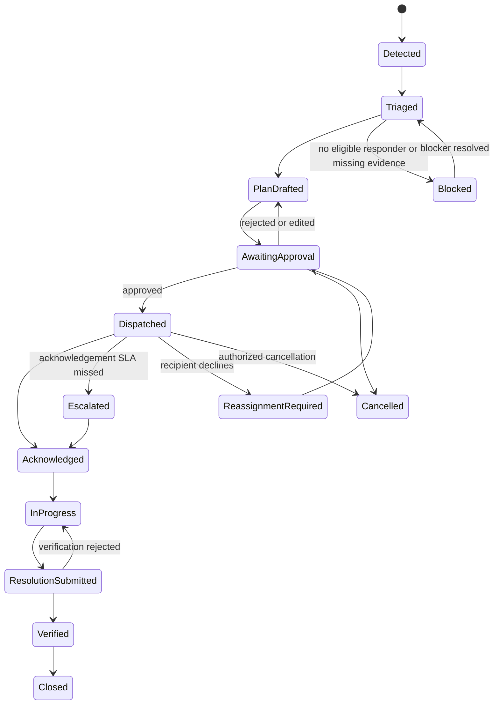
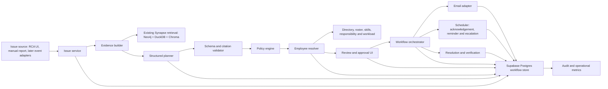

# Product Requirements Document: Synapse Agentic Issue Response

| Field | Value |
|---|---|
| Product | Synapse Agentic Issue Response |
| Status | Draft for product and engineering review |
| Version | 1.0 |
| Date | 14 July 2026 |
| Owners | Product, Operations, Maintenance, QA, Engineering |
| Initial release | Supervised MVP |

## 1. Executive summary

Synapse can already explain an industrial issue, assemble evidence across the graph, structured systems and documents, calibrate confidence, and recommend role-scoped next actions. It does not yet turn that recommendation into coordinated work.

This PRD defines an **agentic response layer** that moves Synapse from “recommend” to “plan, route, communicate, monitor and close.” For an issue such as an equipment failure or quality deviation, Synapse will:

1. Build an evidence-backed understanding of the issue.
2. Propose the actions, required skills, urgency and response SLA.
3. Find eligible employees using role, verified skills, asset responsibility, site, shift/on-call status, availability and workload.
4. Explain why each person was selected.
5. Draft an email and action plan for human review.
6. Send the approved message, collect acknowledgement and track progress.
7. Escalate according to an approved policy when nobody responds.
8. Capture resolution evidence and use the outcome to improve future recommendations.

The MVP is deliberately **supervised**. Synapse may generate and rank, but it may not contact an employee, change production state, create a machine command, or close an issue without the required human authorization. Every action and decision is auditable.

## 2. Background and current-state assessment

The current repository provides a strong intelligence foundation:

- `POST /api/ask` routes a question across Neo4j, DuckDB and Chroma, then synthesizes an answer with evidence and a recommended next step.
- The RCA detail service returns deterministic `recommended_actions` for Maintenance, Reliability and QA.
- Failure detail includes the linked equipment, RCA, technician, procedure, deviations, documents, downstream tests, recurrences and evidence-calibrated confidence.
- The ontology contains 25 demo technicians with role, shift and certification, and links technicians to equipment maintenance and RCA work.
- The UI shows a “Recommended action checklist,” but checklist state is currently local to the browser and does not create durable work.
- Supabase authentication provides `admin`, `qa`, `maintenance` and `ops` roles, but there is no action-level approval policy.

The missing capabilities are:

- A durable issue and action-plan lifecycle.
- Employee contact, availability, on-call, asset-ownership and workload data.
- An eligibility and ranking service for selecting responders.
- Human review and approval of proposed actions and recipients.
- An outbound email integration and safe message templates.
- Acknowledgement, reassignment, escalation, resolution and verification workflows.
- An immutable audit trail and outcome feedback.

## 3. Problem statement

Today, a Synapse user can learn what probably happened and what a function such as Maintenance should do next. The user must then manually determine who is qualified and available, collect the relevant evidence, write the message, contact that person, follow up, escalate and record the outcome.

This manual hand-off causes avoidable delay and inconsistency:

- Recommendations can sit without an owner.
- The nearest or most familiar employee may be contacted instead of the best eligible responder.
- Critical evidence and uncertainty may be lost when the recommendation is copied into an email.
- Nobody has a shared view of acknowledgement, response SLA or escalation state.
- Resolution evidence does not flow back into Synapse.

## 4. Product vision

**When Synapse identifies or receives an operational issue, it should assemble the safest evidence-backed response, find the right accountable people, obtain the necessary approval, coordinate the work and maintain a traceable record through verified closure.**

The product is an orchestrator, not an autonomous plant operator. Intelligence proposes; policy constrains; authorized people decide and act.

## 5. Product principles

1. **Evidence before action.** Every proposed action must link to source records and state uncertainty or missing evidence.
2. **Deterministic safety boundaries.** Models may classify needs and draft plans; code and policy decide eligibility, permission, approval and allowed tools.
3. **Human authority.** The MVP requires a human to approve every first outbound communication and any material plan change.
4. **Least privilege.** The orchestrator receives only the access required for the approved action.
5. **Explainable routing.** Users can see why a responder is eligible, why they ranked above alternatives and which constraints excluded others.
6. **Closed-loop accountability.** A recommendation is not complete until it has an owner, state, timestamps and closure evidence.
7. **Fail safe.** Missing data, low confidence, connector failure or policy ambiguity routes the issue to an authorized supervisor; it never silently expands autonomy.
8. **No inferred employee attributes.** Selection uses verified work data only and never protected, personal or inferred characteristics.

## 6. Goals and success criteria

### 6.1 Goals

- Convert an existing Synapse failure or a manually reported issue into a structured response plan in under 30 seconds, excluding upstream model outages.
- Recommend at least one qualified, currently eligible responder or explicitly explain why no eligible responder exists.
- Let an authorized approver edit and approve the plan, recipients and message from a single review screen.
- Send the approved email exactly once, track delivery and capture acknowledgement.
- Escalate unacknowledged issues through a configured chain.
- Preserve a complete evidence and action audit trail from issue creation to verified closure.
- Capture structured outcome feedback for evaluation and later ranking improvements.

### 6.2 MVP success metrics

| Metric | Target after pilot | Definition |
|---|---:|---|
| Median time to proposed owner | < 30 seconds | Issue creation to ranked candidate list |
| Median time to assignment | 50% lower than pilot baseline | Issue creation to approved dispatch |
| Acknowledgement within SLA | >= 90% | Dispatched assignments acknowledged before deadline |
| Eligible-recipient precision | >= 95% | Domain reviewer confirms selected primary meets all hard constraints |
| Recipient override rate | < 20% after calibration | Approver replaces the top-ranked recipient |
| Unsafe dispatches | 0 | Message sent without required approval or to an ineligible recipient |
| Duplicate outbound messages | 0 | Same approved dispatch sent more than once |
| Audit completeness | 100% | Required events present for every dispatched issue |
| Verified closure rate | >= 85% | Resolved issues with reviewer-approved closure evidence |

Targets are pilot hypotheses and must be re-baselined using real operating data.

## 7. Non-goals for the MVP

- Direct control of PLCs, SCADA, machines, safety systems or production set points.
- Automatically stopping production, releasing material or approving a quality hold.
- Fully autonomous email dispatch without human approval.
- Diagnosing a root cause when the evidence cannot support one.
- Replacing CMMS work-order functionality; the MVP may link to or later create a CMMS work order through a separate approved integration.
- Reading personal mailboxes or using personal employee data.
- Learning employee ranking weights online without review.
- Real-time sensor anomaly detection. The MVP starts from an existing Failure/RCA record or a manually created issue; event ingestion is a later phase.

## 8. Users and roles

| Persona | Primary need | MVP capabilities |
|---|---|---|
| Operations reporter | Report an issue and get the right help quickly | Create issue, view plan, follow status |
| Maintenance planner/supervisor | Route technical work to qualified available staff | Review evidence, edit plan, approve/replace responder, verify closure |
| Maintenance technician/equipment engineer | Receive a clear, evidence-backed assignment | Acknowledge, decline with reason, update status, submit resolution evidence |
| QA lead/inspector | Control downstream quality risk | Review QA actions, approve quality communications, verify quality closure |
| Reliability engineer | Investigate recurrence and systemic causes | Receive analysis task, add findings, recommend preventive action |
| Synapse administrator | Configure integrations and policies | Manage directory sync, skills, SLA, approval and escalation policies |
| Auditor | Reconstruct what the system and humans did | Read immutable issue, evidence, approval, message and state history |

The existing broad application roles remain, but action authorization must be capability-based. Examples: `issue.create`, `plan.review`, `dispatch.approve`, `issue.resolve`, `issue.verify` and `policy.admin`.

## 9. Scope and release strategy

### 9.1 MVP: supervised agentic response

- Manual issue creation and “Create response plan” from an RCA failure detail page.
- Evidence bundle using existing Synapse retrieval and RCA services.
- Structured action-plan generation.
- Deterministic employee eligibility and ranking.
- Review screen with editable action, recipient, SLA and email.
- Required human approval before dispatch.
- One outbound email provider through a provider-agnostic adapter.
- Signed acknowledgement/decline links and in-app response.
- Reminder and supervisor escalation based on pre-approved rules.
- Resolution submission, verification and audit history.
- Dashboard for open, awaiting approval, unacknowledged, active, escalated and verification-pending issues.

### 9.2 Phase 2

- CMMS work-order creation after explicit approval.
- Microsoft Teams/Slack/SMS adapters.
- Calendar, roster and live workload integration.
- Automated issue intake from SCADA/QMS/CMMS event streams.
- Multi-owner parallel plans and dependency-aware task execution.
- Graph representation of verified employee skills, ownership and completed response history.
- Policy-approved auto-dispatch for a narrow set of low-risk, reversible communication-only cases.

### 9.3 Phase 3

- Plant-wide event correlation and proactive response playbooks.
- Dynamic re-planning when evidence, availability or operating conditions change.
- Outcome-based ranking assistance with fairness, drift and safety review.

## 10. Core user journeys

### 10.1 Create a plan from an existing failure

1. A Maintenance supervisor opens failure `F1186` in RCA & Failures.
2. The supervisor selects **Create response plan**.
3. Synapse snapshots the current failure, equipment, RCA, procedure, deviation, recurrence, document and downstream-test evidence.
4. Synapse proposes the issue severity, required actions, required skills, response SLA and approval level.
5. The employee resolver returns eligible candidates and a transparent score breakdown.
6. The supervisor reviews and may edit the action, primary recipient, backup, deadline and message.
7. The supervisor approves dispatch.
8. Synapse sends one email containing the requested action, deadline, bounded evidence summary and secure acknowledgement link.
9. The employee acknowledges or declines. A decline requires a reason and immediately returns the issue for reassignment.
10. If no acknowledgement arrives within policy, Synapse reminds and then escalates.
11. The responder submits completion notes and evidence.
12. An authorized verifier accepts the result or reopens the issue.

### 10.2 Report a new issue without an RCA

1. An Operations user enters a description, asset, observed time and optional attachments.
2. Synapse retrieves related asset, procedure, maintenance, recurrence and quality context.
3. Because root cause is unknown, Synapse labels causal confidence as low and proposes an inspection/triage action rather than a corrective action.
4. The resolver selects an eligible on-shift triage owner.
5. The normal review, approval, dispatch and tracking flow follows.

### 10.3 No eligible employee is available

1. All candidates fail a hard constraint such as active status, site, required certification or on-call coverage.
2. Synapse does not select the “closest” ineligible person.
3. The plan enters `BLOCKED_NO_ELIGIBLE_RESPONDER` and explains each failed constraint in aggregate.
4. The configured supervisor/dispatch desk is notified after approval, with suggested choices: adjust the deadline, use an approved external vendor, or assign a qualified responder from another site.

### 10.4 Critical issue

1. A critical safety, environmental or release-risk issue is created.
2. Synapse creates an immediate triage plan but does not present model-generated diagnosis as fact.
3. The policy engine requires the configured critical-issue approver group and may require parallel notification to Operations and QA/EHS.
4. Only communication is orchestrated; operational shutdown and safety actions remain governed by plant procedures and authorized humans.

## 11. Issue lifecycle



Every transition records actor, timestamp, prior state, next state, reason and correlation ID. State transitions are enforced server-side; clients cannot write arbitrary states.

## 12. Functional requirements

### FR-1: Issue intake — Must

The system shall create an issue from:

- An existing Synapse Failure record.
- A manually entered operational, maintenance or quality observation.

Required fields are issue type, title/description, source, observed time, site and reporter. Asset is required when known. The service must de-duplicate likely repeats by source event ID or idempotency key and warn on similar open issues.

### FR-2: Evidence snapshot — Must

The system shall create a versioned, immutable evidence snapshot for planning that contains:

- Source IDs and source layer (`Graph`, `DFS`, `RAG`, manual observation).
- Relevant failure, asset, RCA, procedure, standard, deviation, recurrence, maintenance and downstream-quality facts.
- Data character, including synthetic/demo status where applicable.
- Retrieval timestamp and content hash.
- Confidence generated from evidence shape, not model self-assessment.
- Missing evidence and causal limitations.

A later plan refresh creates a new evidence version; it does not silently change the basis of an already approved dispatch.

### FR-3: Structured plan generation — Must

The planner shall return schema-validated JSON, not free-form instructions. A plan includes:

- Concise issue summary.
- Severity and impact dimensions.
- Known facts, hypotheses and unknowns as separate fields.
- One or more actions with outcome, required skills, owner type, priority, deadline/SLA and completion evidence.
- Safety and prerequisite checks.
- Recipient-selection requirements.
- Proposed email subject and body.
- Source citations for material claims.
- Confidence and escalation recommendation.

If the model response fails schema or citation validation, the system retries once with validation errors and then falls back to a deterministic triage template.

### FR-4: Action validation and policy — Must

Before a plan can be reviewed, deterministic validators shall check:

- Every material fact cites a source in the evidence snapshot.
- Hypotheses are not stated as confirmed causes.
- The requested action is communication or human work, not a prohibited machine command.
- Required skills, approvals and SLA conform to configured policy.
- The action does not conflict with a quality hold or safety procedure supplied in evidence.
- Message content does not include secrets, unnecessary personal data, raw prompts or hidden model reasoning.

Invalid plans remain drafts with actionable validation errors.

### FR-5: Employee directory — Must

The system shall maintain verified work-profile data for potential responders:

- Employee/contractor ID and active status.
- Work email and preferred work channel.
- Application user ID when present.
- Role, department, site and time zone.
- Manager/escalation owner.
- Verified skills and certifications with validity dates.
- Authorized asset/site scope.
- Shift, roster, on-call and current availability.
- Open assignment count or capacity signal.

Contact details must come from an approved directory source or administrator entry. Synapse must never infer an email address from a person's name.

### FR-6: Eligibility filtering — Must

The resolver shall apply hard constraints before scoring. Unless an approver explicitly changes policy through an authorized override, a candidate is ineligible if any applicable condition is false:

- Active worker.
- Correct site or approved cross-site coverage.
- Required role/skill/certification and non-expired credential.
- Authorized for the affected asset or task risk class.
- On shift/on call or explicitly available for the response window.
- Not blocked by leave, safety restriction or workload hard limit.
- Has a valid approved work contact channel.

The UI must show exclusion reasons without exposing unnecessary personal data.

### FR-7: Candidate ranking — Must

Eligible candidates shall be ranked deterministically. The model may map the issue to required skills, but it may not directly select a person or change weights.

Default MVP score:

| Signal | Weight | Notes |
|---|---:|---|
| Asset responsibility/ownership | 25 | Verified current responsibility for asset or line |
| Required skill and certification fit | 25 | Exact and related verified skills; eligibility is already enforced |
| Shift/on-call and availability fit | 20 | Favors a responder available for the full SLA window |
| Similar verified response experience | 10 | Prior completed issues of the same asset/failure class |
| Site/location fit | 10 | Same site/area where relevant; no personal-location tracking |
| Current workload/capacity | 5 | Fewer active urgent assignments ranks higher |
| Rotation/fairness | 5 | Avoids repeatedly selecting the same person when alternatives are equivalent |

The resolver returns the top three candidates when possible, the primary recommendation, backup, per-signal score, hard constraints passed and data freshness. Ties are resolved using the configured rotation policy, then stable employee ID—not a model preference.

### FR-8: Review and approval — Must

The review screen shall let an authorized user:

- Inspect the evidence snapshot and confidence.
- Compare eligible candidates and exclusion reasons.
- Edit action wording, recipient, backup, SLA and message.
- See validation and policy impacts immediately.
- Approve, reject or request more evidence.
- Provide a reason for replacing the top candidate or overriding a soft recommendation.

No first outbound message may be sent in the MVP without an approval record tied to the exact plan version, recipients and message hash. Editing any of those after approval invalidates approval.

### FR-9: Risk-based approval — Must

Default policy:

| Risk tier | Example | MVP approval |
|---|---|---|
| Tier 1 — routine advisory | Inspect an asset; verify recorded work | One authorized domain approver |
| Tier 2 — high operational/quality impact | Urgent repair coordination; material review | Supervisor or configured domain lead |
| Tier 3 — critical safety, environmental or release risk | Safety triage; potentially affected material | Configured critical-issue group; dual approval if policy requires |
| Prohibited | Machine control, bypassing interlocks, unapproved production release | Cannot be dispatched by this product |

### FR-10: Email drafting and dispatch — Must

The communication adapter shall support one provider in the MVP while exposing a provider-neutral interface. The approved email shall include:

- Issue ID, severity and affected asset/site.
- Requested action and acknowledgement deadline.
- Confirmed facts, explicitly marked hypotheses and key unknowns.
- Why the recipient was selected, using work qualifications only.
- Safe link to the Synapse issue and evidence.
- **Acknowledge** and **Decline** actions using short-lived signed tokens.
- Escalation expectation and sender identity.
- Synthetic/demo disclosure when relevant.

Email dispatch must use an idempotency key of `issue_id + plan_version + recipient + message_hash`. Provider responses, message ID, delivery state and error are stored. Retries use exponential backoff and never create a new logical message.

### FR-11: Acknowledgement and decline — Must

- A recipient can acknowledge, decline or open the issue from email.
- A decline requires a reason such as unavailable, not qualified, wrong asset, workload or other.
- Signed links are single-purpose, short-lived and do not expose issue evidence without authentication.
- Acknowledgement records actor and timestamp and stops the acknowledgement timer.
- A decline opens reassignment and alerts the approver; it does not automatically send to the next person in the MVP.

### FR-12: Reminders and escalation — Must

The scheduler shall evaluate durable deadlines and apply the approved policy:

- Optional reminder at a configured fraction of the acknowledgement SLA.
- Escalation when the SLA expires.
- Escalation to the named backup, supervisor or dispatch desk according to policy.
- Maximum attempt and escalation limits to prevent message storms.
- Quiet-hour behavior except for configured critical issues.

Reminder and escalation templates are pre-approved policy actions. A material change to the work request or a new recipient outside the approved escalation chain requires new human approval.

### FR-13: Work updates and closure — Must

The assigned responder shall be able to:

- Mark `IN_PROGRESS`.
- Add notes and structured findings.
- Attach or link completion evidence.
- Identify a newly discovered risk or request reassignment.
- Submit a resolution.

An authorized verifier must accept closure. Required closure fields are outcome, actions taken, evidence, remaining risk and whether the original recommendation was useful. Rejected closure returns the issue to `IN_PROGRESS` with a reason.

### FR-14: Audit trail — Must

The system shall append an immutable audit event for:

- Issue creation and source.
- Evidence retrieval/versioning.
- Planner model, prompt/template version, structured output hash and validation result. Hidden reasoning is never stored.
- Candidate eligibility, ranking inputs, weights and result.
- Human edits, overrides, approvals and rejections.
- Dispatch attempts, provider responses, delivery and link actions.
- State transitions, reminders, escalations, resolution and verification.

Audit readers can reconstruct what was known, what was proposed, who approved it, what was sent and what happened.

### FR-15: Dashboard and notifications — Should

The product shall provide queues for:

- Awaiting my approval.
- Waiting for acknowledgement.
- Assigned to me.
- SLA at risk.
- Escalated.
- Resolution awaiting verification.
- Closed and reopened.

Filters include site, asset, severity, function, state, owner and date.

### FR-16: Feedback and evaluation — Must

The system shall capture:

- Whether the top responder was accepted or overridden and why.
- Whether the action was accepted, edited or rejected.
- Time to approval, dispatch, acknowledgement, start, resolution and closure.
- Decline, escalation and reopen reasons.
- Whether the recommended action helped resolve the issue.
- Final cause and action where verified.

This data feeds offline evaluation. It must not automatically retrain or change production ranking without governance approval.

## 13. Intelligence and control boundary

| Capability | Model/intelligence | Deterministic service or human |
|---|---|---|
| Summarize evidence | Generate bounded summary | Citation and evidence-version validation |
| Classify issue needs | Suggest severity, skills and actions | Policy limits, required fields and allowed-action validation |
| Find employees | Map task to skill requirements | Hard eligibility filters and ranking calculation |
| Choose recipient | Recommend among ranked candidates | Human approval in MVP |
| Draft message | Generate within a fixed schema/template | PII/secret checks, message hash and human approval |
| Send email | No direct provider access | Communication adapter after valid approval |
| Escalate | Suggest based on issue context | Pre-approved timer and escalation policy |
| Close issue | Summarize submitted outcome | Authorized verifier accepts or reopens |

The model receives tool results but not unrestricted tool credentials. All tools validate tenant/site scope and issue state server-side.

## 14. Data model

Supabase Postgres shall be the **workflow system of record**. Existing Neo4j, DuckDB and Chroma remain evidence sources in the MVP. This avoids treating a read-optimized knowledge graph or local browser state as a transactional workflow engine.

### 14.1 Core tables

| Table | Purpose | Important fields |
|---|---|---|
| `issues` | Durable issue identity and current state | `id`, `source_type`, `source_ref`, `title`, `description`, `issue_type`, `severity`, `site_id`, `asset_id`, `state`, `reporter_id`, timestamps, `version` |
| `issue_evidence_versions` | Immutable evidence snapshots | `issue_id`, `version`, `payload_json`, `source_refs_json`, `confidence_json`, `content_hash`, `created_at` |
| `action_plans` | Versioned proposed response | `issue_id`, `version`, `evidence_version`, `risk_tier`, `status`, `summary`, `known_facts`, `hypotheses`, `unknowns`, `model_info`, `content_hash` |
| `action_steps` | Executable human work items | `plan_id`, `sequence`, `action_type`, `instruction`, `required_skills`, `owner_type`, `due_at`, `completion_requirements` |
| `employee_directory` | Verified work identity/contact | `employee_id`, `user_id`, `work_email`, `active`, `role`, `department`, `site_id`, `timezone`, `manager_id`, `contact_preference`, `source`, `synced_at` |
| `employee_skills` | Verified skills/certifications | `employee_id`, `skill_code`, `level`, `verified_by`, `valid_from`, `valid_until` |
| `asset_responsibilities` | Employee-to-asset authorization/ownership | `employee_id`, `asset_id` or `asset_class`, `responsibility_type`, `valid_from`, `valid_until` |
| `availability_windows` | Shift/on-call/leave/capacity | `employee_id`, `start_at`, `end_at`, `status`, `source`, `synced_at` |
| `candidate_evaluations` | Reproducible eligibility and ranking | `plan_id`, `step_id`, `employee_id`, `eligible`, `exclusion_reasons`, `score`, `score_breakdown`, `ranking_version`, `data_freshness` |
| `assignments` | Approved owner and work state | `step_id`, `employee_id`, `backup_employee_id`, `state`, `ack_due_at`, `work_due_at`, timestamps |
| `approvals` | Authorization tied to exact content | `plan_id`, `plan_version`, `approver_id`, `scope`, `decision`, `reason`, `recipient_hash`, `message_hash`, `created_at` |
| `outbound_messages` | Logical message and provider state | `issue_id`, `assignment_id`, `channel`, `recipient`, `template_version`, `subject`, `body`, `idempotency_key`, `provider_message_id`, `delivery_state`, timestamps |
| `signed_actions` | Hashed, expiring acknowledgement tokens | `message_id`, `action`, `token_hash`, `expires_at`, `used_at` |
| `issue_updates` | Responder notes and evidence | `issue_id`, `assignment_id`, `author_id`, `update_type`, `body`, `attachments`, `created_at` |
| `audit_events` | Append-only event ledger | `issue_id`, `event_type`, `actor_type`, `actor_id`, `correlation_id`, `payload_json`, `created_at`, `prev_hash`, `event_hash` |
| `workflow_policies` | Versioned SLA/approval/escalation rules | `policy_type`, `scope`, `version`, `config_json`, `active_from`, `approved_by` |

### 14.2 Changes to current technician data

The current `Technician` record is insufficient for dispatch because it has only ID, name, role, shift and certification. The MVP must add or sync work email, active status, site, manager, verified skill codes, certification expiry, asset authorization, availability and workload.

Do not overload Neo4j with volatile workflow state. Stable relationships such as verified skill, asset responsibility and completed response history may be projected into the graph in Phase 2 after an ontology version review.

### 14.3 Data freshness rules

- Active status and work contact: no older than 24 hours unless manually verified.
- Shift/on-call/leave: no older than the source roster's current schedule version.
- Workload: no older than 5 minutes when used for urgent ranking; otherwise display a stale-data warning.
- Certification/authorization: must be within its validity window.
- Stale hard-constraint data makes the candidate ineligible or routes for manual verification; it is never assumed valid.

## 15. Proposed architecture



### 15.1 Component responsibilities

- **Issue service:** validates intake, performs idempotent creation and owns legal state transitions.
- **Evidence builder:** reuses existing RCA and Synapse retrieval, normalizes citations and stores immutable snapshots.
- **Structured planner:** calls the configured model with a strict response schema and bounded tools.
- **Validator/policy engine:** rejects unsupported claims, prohibited actions and missing approvals.
- **Employee resolver:** loads verified directory data, applies hard constraints and calculates the reproducible ranking.
- **Workflow orchestrator:** creates assignments, validates approvals and schedules durable actions.
- **Communication adapter:** renders approved templates and sends email with idempotency and delivery tracking.
- **Scheduler/worker:** executes reminders, expiry and escalations from database-backed jobs; it must survive API restarts.
- **Audit service:** appends tamper-evident events and exposes authorized read views.

### 15.2 Deployment implications

- The FastAPI API remains the entry point, but long-running orchestration must run in a separate worker or durable scheduled-job process.
- A server-only Supabase service credential is required for workflow writes and must never appear in the frontend.
- Provider secrets are server-only and referenced by configuration, never stored in plan or audit payloads.
- Email is behind an interface so Microsoft Graph, an SMTP relay or another enterprise provider can be selected without changing issue logic.
- The existing `/api/rca/*` read routes remain unchanged; the agentic layer consumes them or their store functions.

## 16. API requirements

Indicative REST surface:

| Method and path | Purpose | Authorization |
|---|---|---|
| `POST /api/issues` | Create manual or source-linked issue | `issue.create` |
| `GET /api/issues` | List permitted issues | Authenticated + scope filter |
| `GET /api/issues/{id}` | Get issue, current plan and timeline | Issue/site scope |
| `POST /api/issues/{id}/evidence/refresh` | Create new evidence version | `plan.review` |
| `POST /api/issues/{id}/plans` | Generate a draft plan | `plan.review` |
| `PUT /api/issues/{id}/plans/{version}` | Edit draft with optimistic concurrency | `plan.review` |
| `GET /api/issues/{id}/candidates` | Resolve and rank eligible responders | `plan.review` |
| `POST /api/issues/{id}/approvals` | Approve/reject exact plan/message/recipients | `dispatch.approve` + policy scope |
| `POST /api/issues/{id}/dispatch` | Dispatch an already approved plan | Server validates approval; no frontend provider access |
| `POST /api/issues/{id}/acknowledge` | Authenticated acknowledgement | Assigned responder |
| `POST /api/issues/{id}/decline` | Decline with reason | Assigned responder |
| `POST /api/issues/{id}/updates` | Add progress/resolution evidence | Assigned responder or scoped lead |
| `POST /api/issues/{id}/resolution` | Submit resolution | Assigned responder |
| `POST /api/issues/{id}/verification` | Accept closure or reopen | `issue.verify` |
| `GET /api/issues/{id}/audit` | Read timeline/audit | `audit.read` + scope |
| `POST /api/webhooks/email/{provider}` | Delivery/bounce events | Provider signature verification |

Every mutating endpoint accepts an idempotency key and expected resource version. Responses include a correlation ID. Conflicting versions return `409`, unauthorized state transitions return `422`, and insufficient permission returns `403`.

## 17. User experience requirements

### 17.1 RCA integration

Add a **Create response plan** action beside the current recommended-action checklist. The current checklist remains an explanatory view until a durable issue is created.

### 17.2 Plan review page

The review page must show, in this order:

1. Issue, severity, affected asset and status.
2. Confirmed facts, hypotheses, unknowns and confidence.
3. Proposed actions and completion evidence.
4. Primary and backup responder cards with eligibility and score explanations.
5. Editable email preview and SLA.
6. Required approval policy and validation status.
7. **Approve and send**, **Save draft**, **Request evidence** and **Reject** actions.

The primary action must never imply dispatch before approval validation. Users receive a final confirmation listing recipient, subject, deadline and escalation rule.

### 17.3 Issue detail page

Show a single timeline containing plan versions, approvals, message delivery, acknowledgement, updates, escalation, resolution and verification. The evidence used for each message must remain viewable even after newer evidence arrives.

### 17.4 Accessibility and mobile

- Full keyboard operation and visible focus.
- Status is communicated with text and icon, not color alone.
- Email action links have an accessible confirmation page.
- Approve/send is usable on mobile but preserves the same confirmation and policy checks.

## 18. Email content contract

Example structure:

```text
Subject: [Synapse][HIGH][ISS-2026-0042] Inspection required — EQ-RHF-01

Action requested
Inspect the cooling airflow and coolant path on EQ-RHF-01 and attach the
inspection readings and work record by 16:30 IST.

Why you were selected
You are on the current site roster, authorized for this asset class, and have
the required mechanical-maintenance certification. This selection was approved
by <approver>.

Confirmed evidence
- Failure F1186 is linked to EQ-RHF-01.
- RCA1186 records insufficient heat dissipation and a cooling verification gap.

Evidence boundary
The linked demo work-order narrative is synthetic. The recorded association does
not by itself prove that the procedure gap caused the failure.

Please acknowledge by 15:45 IST.
[Acknowledge] [Decline] [Open issue]

If unacknowledged, this issue will be escalated to <role/group> at 15:45 IST.
```

The renderer uses structured fields; the model cannot add arbitrary HTML, recipients, tracking pixels or external links.

## 19. Safety, security and privacy requirements

### 19.1 Safety

- Maintain an explicit denylist of action types the orchestrator cannot dispatch, including control commands, interlock bypass, production release and safety approval.
- Treat low-confidence causal output as a hypothesis and request inspection/verification rather than a corrective change.
- Require domain-specific critical-issue policy and escalation contacts.
- Stop dispatch if evidence, candidate eligibility or approval has changed since review.
- Provide a global outbound-communication kill switch and per-tenant/site pause.

### 19.2 Security

- Server-side RBAC plus site/asset scopes on every issue and directory query.
- Row-level security for workflow data where direct Supabase access is used.
- Encrypt provider credentials and work contact data at rest and in transit.
- Signed, expiring, single-use action tokens stored only as hashes.
- Webhook signature verification and replay protection.
- Rate limits per issue, recipient and site.
- Content sanitization for attachments and retrieved documents; retrieved text is untrusted data and cannot issue tool instructions.
- No hidden model reasoning in logs, messages or audit events.

### 19.3 Privacy and fairness

- Use work contact and qualification data only for operational response.
- Do not use age, gender, caste, religion, disability, family status, personal location, mail content or inferred traits.
- Make rotation and workload weighting visible and reviewable.
- Provide an employee-directory correction process.
- Define retention for message bodies, employee ranking records and attachments with Legal/HR before production.

## 20. Reliability and non-functional requirements

| Area | Requirement |
|---|---|
| Availability | Issue read/review API target >= 99.9% during pilot operating hours |
| Durability | No approved assignment, message or state transition is lost after process restart |
| Idempotency | Replayed API calls, jobs and provider retries produce one logical effect |
| Performance | Existing failure to draft plan p95 < 45 s; candidate resolution p95 < 2 s for 10,000 employees |
| Consistency | Optimistic concurrency on issues/plans; approval binds exact hashes and versions |
| Observability | Structured logs, traces and metrics share correlation/issue IDs; no secrets or unnecessary PII |
| Explainability | 100% of ranked candidates have eligibility and score breakdown; all material plan facts have citations |
| Recovery | Failed jobs are retryable and visible in a dead-letter/admin queue |
| Time handling | Store UTC; display site/recipient time zone; daylight-saving safe where applicable |
| Localization | MVP message/UI language is English; architecture supports future plant-language templates |

## 21. Failure handling

| Failure | Required behavior |
|---|---|
| Model unavailable | Use deterministic triage plan; never fabricate analysis |
| Invalid model output | Retry once, then fall back and flag for review |
| Evidence source unavailable | Show missing layer, lower confidence and require reviewer acknowledgement |
| Directory/roster stale | Exclude affected candidate or require explicit manual verification |
| No eligible responder | Block assignment and route to supervisor/dispatch desk |
| Email provider timeout | Retry using same idempotency key; show pending/failed state |
| Hard bounce | Stop retries, mark contact invalid and return for reassignment |
| Recipient declines | Record reason, stop their SLA and request approved reassignment |
| Approval expires or plan changes | Invalidate approval and require new review |
| Worker outage | Durable jobs resume without duplicate sends |
| Suspected prompt injection | Exclude instruction-like retrieved content from tool control, flag source and continue with bounded evidence |

## 22. Evaluation and test strategy

### 22.1 Offline product evaluation

Build a domain-reviewed gold set of at least 100 varied issues covering equipment failures, procedure gaps, quality deviations, recurrence, incomplete evidence and no-eligible-responder cases. Score:

- Fact/citation correctness.
- Fact versus hypothesis separation.
- Action appropriateness and safety.
- Required-skill extraction.
- Eligibility precision and top-three responder relevance.
- Approval-tier correctness.
- Email completeness and bounded claims.

### 22.2 Deterministic tests

- State-machine transition tests.
- Ranking fixture tests with exact expected eligibility, scores and tie-breaking.
- Certification-expiry, leave, cross-site, workload and stale-data cases.
- Approval invalidation after recipient, message, plan or evidence changes.
- Idempotent issue creation, dispatch, webhook and scheduled-job replay.
- RBAC and scope matrix tests for every mutating endpoint.
- Signed-link expiry, replay and cross-issue misuse tests.

### 22.3 Safety red-team cases

- Retrieved document tells the agent to ignore policy or email an external address.
- User asks Synapse to bypass approval or contact an ineligible person.
- Model presents correlation as confirmed causation.
- Message attempts to include secrets, raw sensor dumps or employee personal data.
- Critical issue is misclassified as routine.
- Malicious attachment or webhook payload.
- Duplicate provider response and out-of-order events.

### 22.4 Pilot validation

Run shadow mode first: Synapse creates plans and rankings, but supervisors execute their existing workflow. Compare selected responder, action, timing and outcome. Enable approved email dispatch only after eligible-recipient precision and critical-risk review meet the agreed thresholds.

## 23. Acceptance criteria for the supervised MVP

The MVP is complete when all of the following are demonstrated in a production-like environment:

1. An authorized user can create one issue from a failure and one from a manual report.
2. Each issue receives an immutable, cited evidence snapshot with confidence and missing-evidence flags.
3. Plan output validates against a documented JSON schema and separates facts, hypotheses and unknowns.
4. Prohibited actions cannot reach approval or dispatch.
5. Candidate resolution enforces active status, work contact, site, qualification, authorization and availability.
6. The UI shows top candidates, score breakdown, data freshness and exclusions.
7. No eligible candidate results in a blocked state, not a fabricated assignment.
8. Approval is bound to the exact plan version, recipients and message hash.
9. Editing approved content invalidates approval.
10. One approved email is sent exactly once under API/job replay testing.
11. A recipient can acknowledge or decline securely; a reused/expired token fails safely.
12. Missed acknowledgement triggers the configured reminder/escalation without a message storm.
13. A responder can submit resolution evidence and an authorized verifier can close or reopen.
14. The audit view reconstructs all required automated and human events.
15. RBAC, scope, privacy, safety and provider-failure tests pass.
16. Shadow-mode ranking and action quality meet pilot thresholds approved by domain owners.

## 24. Delivery plan

### Milestone 0: data and governance readiness

- Confirm issue taxonomy, severity, SLA and approval matrix.
- Select the approved employee directory/roster source and email provider.
- Add demo-safe contact, skill, asset-responsibility and availability data.
- Approve privacy, retention and critical-issue escalation policy.

### Milestone 1: durable issue foundation

- Supabase workflow schema, state machine, RBAC/capabilities and audit ledger.
- Issue creation from RCA and manual report.
- Evidence versioning and issue dashboard skeleton.

### Milestone 2: planning and responder resolution

- Structured plan schema, planner, validation and deterministic fallback.
- Employee directory sync/import.
- Eligibility, ranking, explanations and offline evaluation harness.

### Milestone 3: review, approval and email

- Plan-review UI, policy decision and approval binding.
- Email adapter, safe templates, idempotent dispatch and provider webhooks.
- Signed acknowledge/decline flow.

### Milestone 4: monitoring and closure

- Durable scheduler, reminder/escalation and dead-letter handling.
- Progress, resolution, verification and reopen flow.
- Operational metrics, audit view and admin kill switches.

### Milestone 5: shadow pilot and supervised launch

- Domain-review gold set and safety test completion.
- Shadow-mode comparison and threshold review.
- Limited-site, limited-issue-class rollout with all dispatches supervised.
- Weekly review of overrides, declines, escalations, unsafe proposals and missed SLAs.

## 25. Risks and mitigations

| Risk | Impact | Mitigation |
|---|---|---|
| Incorrect cause leads to wrong work | Safety/downtime | Separate facts/hypotheses, evidence validation, low-confidence triage action, human approval |
| Wrong or unavailable employee selected | Delayed response | Verified hard constraints, freshness rules, top-three explanation, decline/reassignment path |
| Employee data is incomplete | Unreliable routing | Data-readiness gate, no inference, explicit blocked state, directory-quality dashboard |
| Automation sends duplicate/noisy mail | Trust and operational disruption | Idempotency, retry limits, escalation cap, quiet hours, kill switch |
| Model or retrieved document manipulates tools | Unauthorized action | Structured tool contracts, untrusted-content boundary, policy enforcement outside model |
| Workflow state diverges during concurrent edits | Wrong dispatch | Versioning, optimistic locking, approval content hashes, transactional outbox |
| Ranking creates unfair workload | Morale/compliance | Transparent weights, capacity/rotation signal, override reasons, periodic fairness review |
| Users bypass the system | Incomplete audit | Make review/dispatch faster than manual hand-off; link messages and closure evidence to one issue view |

## 26. Product decisions and open questions

### 26.1 Decisions made in this PRD

- MVP autonomy level is supervised: human approval before first external communication.
- Models propose actions and skill needs; deterministic services enforce employee eligibility and ranking.
- Supabase Postgres is the transactional workflow system of record.
- Existing graph, structured and document stores remain evidence sources.
- Email is the first action channel and is implemented behind a provider adapter.
- Issue intake begins with manual reports and existing Failure records.
- Machine control and production/quality release decisions are prohibited.

### 26.2 Decisions required before implementation

1. Which enterprise email provider and sender identity will the pilot use?
2. What is the authoritative employee directory, roster/on-call and workload source?
3. Who may approve each risk tier at each site, and is dual approval required for Tier 3?
4. What are acknowledgement and work-completion SLAs by severity and local quiet-hour rules?
5. Which issue classes and site will be included in the first pilot?
6. What evidence is mandatory before an issue can be marked resolved and verified?
7. What retention periods apply to employee selection records, message bodies and attachments?

Development defaults until these are answered: synthetic employee contact data, sandbox email, one pilot site, manual trigger, approval for every send, 30-minute acknowledgement for high severity, 4-hour acknowledgement for routine severity, and supervisor escalation only.

## 27. Example end-to-end output

For a demo failure such as `F1186`, Synapse would not simply display “Maintenance should inspect the cooling system.” It would create:

- **Issue:** High-priority suspected cooling-path problem on `EQ-RHF-01`.
- **Evidence boundary:** The RCA records insufficient heat dissipation and a procedure gap; the linked work-order narrative is synthetic and the association does not prove causation.
- **Action:** Inspect cooling airflow, coolant condition and passages; record measurements and attach closure evidence.
- **Required responder profile:** Active on-shift/on-call employee, authorized for the asset class, with verified mechanical maintenance/cooling-system skill and a valid work email.
- **Candidate result:** Top three eligible employees with score breakdown and freshness; no person is chosen from name, generic role or past RCA authorship alone.
- **Approval:** Maintenance supervisor reviews the action, recipient, SLA and message.
- **Execution:** Approved email is sent once; acknowledgement and response clocks begin.
- **Closure:** Technician attaches readings and work record; supervisor verifies the outcome; the verified facts become future evidence.

This is the core product shift: **from a recommendation with no owner to a governed, traceable response with the right owner and a verified outcome.**

## 28. Definition of done

The release is done when the acceptance criteria pass, pilot owners approve the ranking and safety results, outbound email is limited to the configured pilot scope, rollback/kill-switch procedures are tested, and operational ownership exists for directory freshness, failed jobs, provider incidents, policy changes and audit requests.
